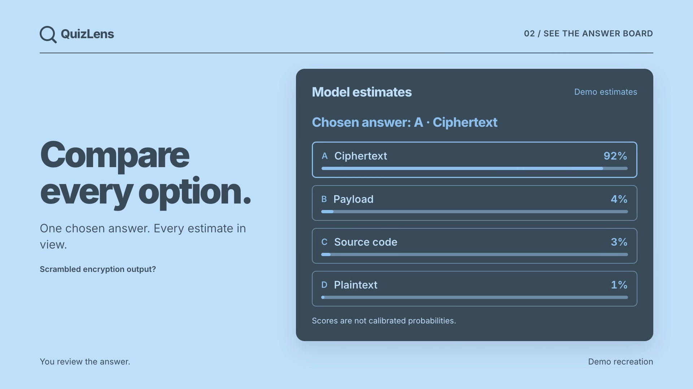

[](https://github.com/kevkoa2106/quizlens/blob/main/docs/quizlens-demo.mp4)

[Watch the 20-second demo](https://github.com/kevkoa2106/quizlens/blob/main/docs/quizlens-demo.mp4)

# QuizLens

Read a multiple-choice question from your browser tab and compare answers with a model you choose. QuizLens works in Chrome and Firefox, showing one chosen answer and scores for each option.

## Contents

- [Install](#install)
- [Use](#use)
- [Models](#models)
- [Laya setup](#laya-setup-optional)
- [Data and limits](#data-and-limits)
- [Development](#development)
- [Tests](VERIFICATION.md)
- [Privacy policy](PRIVACY.md)
- [Contributing](CONTRIBUTING.md)
- [Security reporting](SECURITY.md)
- [License](LICENSE)
- [Third-party licenses](THIRD_PARTY.md)

## Install

Download your browser's ZIP from [the latest release](https://github.com/kevkoa2106/quizlens/releases/latest).

For Firefox Add-ons submissions, upload **quizlens-firefox.zip** from the release assets. GitHub's **Source code (zip)** contains the repository and cannot be installed as an extension.

- **Chrome 116+:** unzip, open `chrome://extensions`, enable Developer mode, and load the folder with **Load unpacked**.
- **Firefox 142+:** open `about:debugging#/runtime/this-firefox`, choose **Load Temporary Add-on**, and select the ZIP. This unsigned installation lasts until Firefox restarts.

## Use

1. Open a quiz tab and click the QuizLens toolbar icon.
2. In **Model settings**, choose a provider, enter the model and credentials, then save.
3. Choose **Capture this tab** to read the DOM and compare automatically. Correct any text and choose **Compare answers** to retry.

For image or canvas questions, select **Image (vision model)** and capture the tab or upload a PNG/JPEG. Your model must support images. QuizLens does not click or submit answers.

In **Appearance**, choose green, blue, red, or grey. Colours follow your browser's light or dark mode; the choice stays on this device.

## Models

| Provider | Settings |
| --- | --- |
| LM Studio / local API | `http://127.0.0.1:1234/v1`, model, optional key |
| Ollama | `http://127.0.0.1:11434`, model, optional proxy key |
| OpenAI | Model and API key |
| Anthropic | Model and API key |
| Laya | Local Python service and token |

Only Laya needs the QuizLens service. Local endpoints must use HTTP `localhost` or `127.0.0.1`.

Ollama may need [allowed extension origins](https://docs.ollama.com/faq#how-can-i-allow-additional-web-origins-to-access-ollama):

```sh
OLLAMA_ORIGINS='chrome-extension://*,moz-extension://*' ollama serve
```

If Ollama rejects the thinking control, disable non-thinking mode in settings.

## Laya setup (optional)

Requires Python 3.13, Git, and Tesseract. On macOS, from the cloned repository:

```sh
brew install python@3.13 tesseract
sh setup.sh
sh start.sh
```

Keep the service running, select Laya, and paste its printed token. First use downloads model weights. Laya supports text only.

## Data and limits

Model settings and keys last for the browser session. The colour scheme is saved locally until the extension is removed. Captures go to your selected provider; cloud APIs may charge for usage. Local servers may also use cloud models, depending on their configuration.

See the [privacy policy](PRIVACY.md) for data handling and deletion controls.

Scores are model estimates, not calibrated probabilities. Tied choices are tentative. Unusual layouts may need manual correction or image mode. After changing tabs or websites, click the toolbar icon again to grant capture access.

## Development

Requires Node 24+. Build both browser packages:

```sh
git clone https://github.com/kevkoa2106/quizlens.git
cd quizlens
npm ci
npm run build
```

Output: `dist/chrome` and `dist/firefox`. For Firefox, load `dist/firefox/manifest.json` as a temporary add-on.

Run `npm run package` to create `dist/quizlens-chrome.zip` and `dist/quizlens-firefox.zip`. Packaging checks the Firefox ZIP with Mozilla's validator and fails on errors or warnings.

QuizLens code uses [MIT](LICENSE). Laya and other dependencies retain their [upstream licenses](THIRD_PARTY.md). See [tests and verification](VERIFICATION.md) and [contribution guidance](CONTRIBUTING.md).
